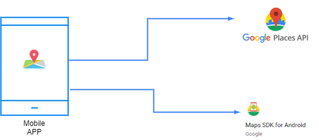
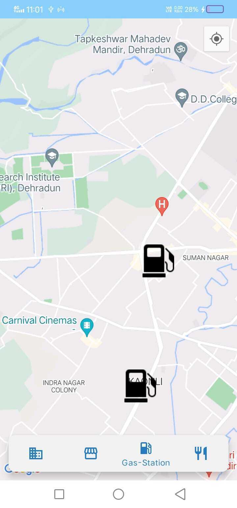

# Search Nearby Places

> An Android Application To Search Nearby Business Using Kotlin

A mobile app is built where the user can search for his nearby locations based on his requirement.
Whenever the user gives input of business type like a hotel, petrol pumps, hospitals, etc.
using Place API and as a response we obtain the co-ordinates that are marked on the Google map.

- api key in files, use your own
    - `.\app/src/main/java/com/shivanshu/nearbybusiness\MapsActivity.kt`
    - `.\app/src/main/AndroidManifest.xml`

## Screenshots

# A Grocery Android App

As we can't remember everything, users frequently forget to buy the things they
want to buy. However, with the assistance of this app, you can make a list of
the groceries you intend to buy so that you don't forget anything.

## Screenshots

