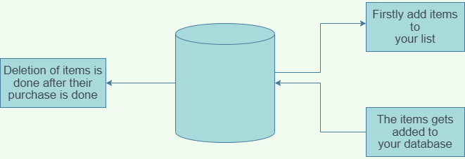
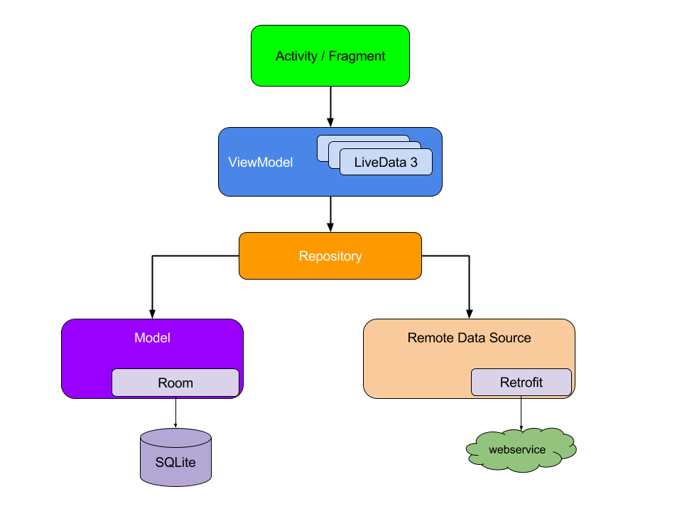
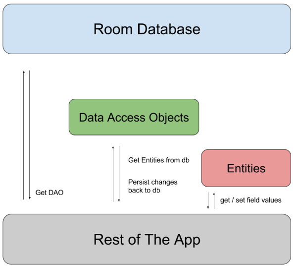
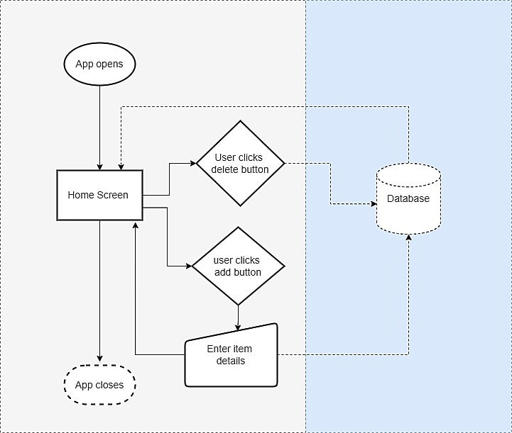

# Grocery List

## Introduction

### Overview

Groceries are one of the most essential daily requirements of a family. Quite often, we
do not pay much attention to it and we just go on a shopping spree without any proper
list of required items and quite often we forget many items and are not aware of the
total cost of all the items.

- In today’s digitalized world making a list of items and calculating their total cost on a
  pen and paper seems to be a very lethargic task.
- Hence we bring to you a grocery app, in which you can easily list all your items with their
  total cost. We have made database of our app using room database and we have used
  MVVM for architecture purpose of our app. Designing of the app is purely done on XML
  and backend of the app is done in Kotlin language.

### Purpose

- The main purpose of this app is to simplify your shopping list and save your
  precious time.
- It also helps to estimate total cost required for the required items.
- It is a very simplified app which can be used by anyone, who does not have
  any knowledge about digital world.
- After buying the items users can delete the following item, which helps
  them to keep track of the items they have to purchase. It helps in reduction
  of human errors of forgetting items.
- This app is quite useful as in today’s busy world no one has time to list
  down items on a pen and paper, hence listing down items on an app is
  much simplified and time efficient.

## Literature Survey

### Existing Problem

The main problem is that in today's world no one has time to list down their
grocery items on pen and paper and so when people go for shopping,most
of the time they forget their daily essentials and regret it after coming back.

### Proposed Solution

The goal of this project is to make an app that stores the user items in a
cart and can modify and delete the added item in the list. To develop a
reliable system, I have some specific goals such as:

- Develop a system such that users can add item details like product name,
  product Quantity, and Product Price.
- Develop a database room that is used to store the user data
  which already been added by the user in the cart and the user can
  also remove the previously added item in the cart.
- Develop a good UI design that user friendly to the user.
- Develop a good UI that is supported for all android devices.

## Theoretical Analysis

### Block Diagram

### Hardware And Software Requirements

#### Software Requirements

- OS: Windows 10
- IDE: Android Studio Dolphin
- Programming Language: Kotlin IDE

#### Hardware Requirements

- Processor: i5 10th gen and above
- RAM: 8GB of RAM
- Storage: 50MB of HDD space
- Testing: External Android device for testing

## Architectural Design Of The Project

In this project, we are using MVVM (Model View ViewModel) for
architectural patterns, Room for database, Coroutines and RecyclerView to
display the list of items.

### MVVM (Model View ViewModel)

- MVVM architecture in android is used to give structure to the project’s
  code and understand code easily.
- Model–view–viewmodel (MVVM) is a software architectural pattern that
  facilitates the separation of the development of the graphical user interface
  (the view) – be it via a markup language or GUI code – from the
  development of the business logic or back-end logic (the model) so that the
  view is not dependent on any specific model platform.
- The MVVM is basically seperated into three layers:eparate code layers of MVVM are:

- Model: This layer is responsible for the abstraction of the data sources.
  Model and ViewModel work together to get and save the data.
- View: The purpose of this layer is to inform the ViewModel about
  the user’s action. This layer observes the ViewModel and does not
  contain any kind of application logic.
- ViewModel: It exposes those data streams which are relevant to the
  View. Moreover, it serve as a link between the Model and the View.

## ROOM Database

Apps that handle non-trivial amounts of structured data can benefit greatly from
persisting that data locally. The most common use case is to cache relevant pieces of
data so that when the device cannot access the network, the user can still browse that
content while they are offline.The Room persistence library provides an abstraction layer
over SQLite to allow fluent database access while harnessing the full power of SQLite.In
particular, Room provides the following benefits:

- Compile-time verification of SQL queries.
- Convenience annotations that minimize repetitive and error-prone boilerplate,

There are three major components in Room:

- The **database class** that holds the database and serves as the main access
  point for the underlying connection to your app's persisted data.
- **Data entities** that represent tables in your app's database.
- **Data access objects (DAOs)** that provide methods that your app can use to query,
  update, insert, and delete data in the database.

## Structure Of Project

- Step 1:To create a new project:

To create a new project in Android Studio please refer to How to Create/Start a New
Project in Android Studio. Note that select Kotlin as the programming language.

- Step 2: Before going to the coding section first you have to do some pre-task Before
going to the coding part first add these libraries in your gradle file and also apply the
plugin as `kotlin-kapt`.

- Step 3: Implement Room Database :
    - Entities class :
        The entities class contains all the columns in the database and it should be annotated
        with `@Entity (tablename = "Name of table")`. Entity class is a data class. And @Column
        info annotation is used to enter column variable name and datatype. We will also add
        Primary Key for auto-increment .Create Kotlin file/class and name the file as
        `GroceryEntities`.
    - DAO Interface :
        The DAO(Data Access Objects) is an interface in which we create all the functions that
        we want to implement on the database. This interface also annotated with @Dao. Now
        we will create a function using suspend function which is a coroutines function. Here
        we create three functions, First is the insert function to insert items in the database and
        annotated with @Insert, Second is for deleting items from the database annotated with
        @Delete and Third is for getting all items annotated with @Query. Create Kotlin
        file/class and name the file as GroceryDao.
    - Database class :
        Database class annotated with @Database(entities = [Name of Entity class.class],
        version = 1) these entities are the entities array list all the data entities associating with
        the database and version shows the current version of the database. This database
        class inherits from the Room Database class. In GroceryDatabase class we will make an
        abstract method to get an instance of DAO and further use this method from the DAO
        instance to interact with the database. Create Kotlin file/class as GroceryDatabase.
- Step 4 :Now we will implement the Architectural Structure in the App:
    - Repository class :
        The repository is one of the design structures. The repository class gives the data to the
        ViewModel class and then the ViewModel class uses that data for Views. The repository
        will choose the appropriate data locally or on the network. Here in our Grocery
        Repository class data fetch locally from the Room database. We will add constructor
        value by creating an instance of the database and stored in the db variable in the
        Grocery Repository class.
    - ViewModel class :
        ViewModel class used as an interface between View and Data. Grocery View Model
        class inherit from View Model class and we will pass constructor value by creating
        instance variable of Repository class and stored in repository variable. As we pass the
        constructor in View Model we have to create another class which is a Factory View
        Model class.Create a Kotlin file/class and name the file as GroceryViewModel.
    - FactoryViewModel class : We will inherit the Grocery ViewModel Factory class
        from ViewModelProvider. NewInstanceFactory and again pass constructor value by
        creating instance variable of GroceryRepository and return GroceryViewModel
        (repository).Create a Kotlin file/class name it GroceryViewModelFactory.
- Step 5 : Now let’s jump into the UI part
    In the activity_main.xml file, we will add two ImageView, RecyclerView, and Button after
    clicking this button a DialogBox open and in that dialog box user can enter the item
    name, item quantity, and item price.
- Step 6: Let’s implement RecyclerView :
    Now we will code the UI part of the row in the list. Add a Layout Resource File and name
    it as `GroceryAdapter`. We will code adapter class for recycler view. In the `GroceryAdapter`
    class, we will add constructor value by storing entities class as a list in list variable and
    create an instance of the view model. In Grocery Adapter we will override three
    functions: onCreateViewHolder, getItemCount, and `onbindViewHolder`, we will also
    create an inner class called grocery view holder. Create a new Package called Adapter
    and then right-click on Adapter package and create a Kotlin file/class name it
    `GroceryAdapter`.
- Step 7 :
    To enter grocery item, quantity, and price from the user we have to create an interface.
    To implement this interface we will use DialogBox. First create UI of dialog box. Three
    edit text to enter grocery item name, quantity and price. After clicking the save text all
    data saved into the database and by clicking on the cancel text dialog box closes. To
    add a `clicklistener` on save text we have to create an interface first in which we create a
    function.
- Step 8:
    In this final step we will code in our MainActivity. In our MainActivity, we have to set up
    the recycler view and add click listener on add button to open the dialog box.
    Fig: Structure Of Project

## Flowchart

## Advantages

- In today's digitalised and hectic world no one has time to remember a list of grocery
    items to be purchased.This app makes our life easier as we no longer have to remember
    items.
- It helps save a lot of our crucial time
- It is a very simple to use grocery list app which can be used by anyone.
- Our habit of forgetting items is overcome by this app.
- It also helps us to estimate the total cost of all our items and helps to manage our expenses.
- Changes to the list of items can easily be accommodated without any major issues.

## Disadvanatges

- One of the major drawbacks of this app is that it does not tell the cost of
  the item we want to purchase.Prices of the product have to mentioned manually
  and may vary from the store to store.
- Another drawback is that it does not tell whether the following items mentioned in the
  list are available in the nearby store or not. 
- After all it is an application,and may crash due to database or server error.

## Applications

- This app is majorly used while shopping a variety of items from supermarkets
  or provisional stores.
- We can easily tally the given bill by the shopkeeper and our list of items so
  as to avoid any error in the billing.
- We can instantly verify the cost of the item we want to purchase in the
  supermarket with our list and check whether there is an increase in the price
  of the items or not.
- It can be used by major Supermarkets for purchasing a bulk of items and get
  their estimated cost.

## Conclusion

I conclude that this app is a major breakthrough in today's tech world as this will help us
provide the list of items we want to purchase with their total cost.This app store data in
our own local storage hence making changes in that app will not be a major issue.This
app help us in advancement of our technology and start to live in a modern world.

## Future Scope

- A major change that can be accommodated in future is that we can add the prices
  of particular product in the list in nearby stores which will help users to get
  best value of their required product.
- Also we can add a timer in the app to help us remember to bring our grocery items in time.
- Another feature that we can add in the near term future is the recommendations
  of similar grocery items that we regularly use through Artificial Intelligence.
- We can improve the quality of server so as to store more items at the same
  time without any crashing of the app.
- We are open to any changes in our app that will help in enhancement of our app.

## References

- <https://developer.android.com/courses/android-basics-kotlin/course>
- <https://blog.mindorks.com/blogs/android>
- <https://www.geeksforgeeks.org/android-app-development-fundamentals-for-beginners/>
